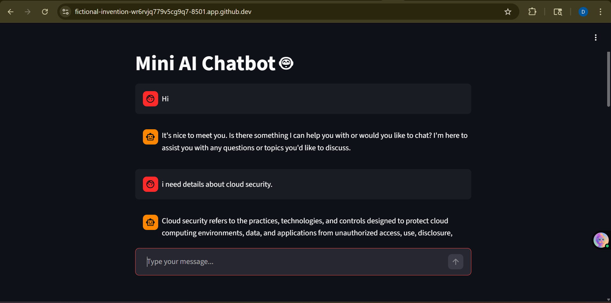

# 🤖 Mini AI Chatbot (Groq + Streamlit)

A simple, fast, and interactive AI chatbot built using **Streamlit** and **Groq LLM API**.
This project demonstrates how to integrate a Large Language Model (LLM) into a web app with minimal setup.

---

## 🚀 Features

* 💬 Real-time chat interface
* 🧠 Powered by LLM (`llama-3.3-70b-versatile`)
* 📝 Maintains chat history (session-based memory)
* ⚡ Fast responses using Groq inference
* 🔐 Secure API key handling using `.env`

---

## 📸 Demo



---
## 🏗️ Architecture

```
User → Streamlit UI → Python App → Groq API (LLM) → Response → UI
```

---

## 🛠️ Tech Stack

* **Frontend:** Streamlit
* **Backend:** Python
* **LLM API:** Groq
* **Environment Management:** python-dotenv

---

## 📦 Installation

### 1️⃣ Clone the repository

```bash
git clone https://github.com/your-username/mini-ai-chatbot.git
cd mini-ai-chatbot
```

---

### 2️⃣ Install dependencies

```bash
pip install -r requirements.txt
```

Or manually:

```bash
pip install streamlit groq python-dotenv
```

---

### 3️⃣ Setup environment variables

Create a `.env` file in the root directory:

```
GROQ_API_KEY=your_api_key_here
```

---

## ▶️ Run the App

```bash
streamlit run app.py
```

Open in browser:

```
http://localhost:8501
```

---

## 🧾 Project Structure

```
mini-ai-chatbot/
│── app.py
│── .env
│── requirements.txt
│── README.md
```

---

## ⚙️ Configuration

You can modify response length:

```python
max_tokens=300
```

* Increase → longer responses
* Decrease → faster & cheaper

---

## 🧠 Model Used

```
llama-3.3-70b-versatile
```

* High-quality responses
* Good reasoning capability
* Optimized for chat

---

## 🔒 Security Note

* Never commit `.env` file
* Add this to `.gitignore`:

```
.env
```

---

## 🚀 Future Improvements

* ✅ Persistent memory (database)
* 🌐 Deploy to cloud (Render / Railway)
* 🎤 Voice input support
* 📄 Resume-based chatbot (AI Interview Coach)
* 🔑 User authentication

---

## 💡 Use Cases

* AI assistant
* Learning chatbot
* Interview preparation bot
* Domain-specific Q&A system

---

## 🤝 Contributing

Feel free to fork this repo and improve it!

---

## 📜 License

This project is open-source and available under the MIT License.

---

## 🙌 Acknowledgements

* Groq for ultra-fast LLM inference
* Streamlit for simple UI development

---
